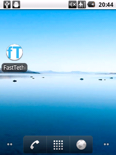

# FastTether

Simple utility to toggle tethering and airplane mode.

 

## Platform

Android 2.2 or later

## License

[Apache License, Version 2.0](http://www.apache.org/licenses/LICENSE-2.0.html)

## Background

I have a mobile device - HUEWAY IDEOS which is usually set offline and be set online for only tethering.  
This operation is annoying, so I developed this utility.  
Just tap the icon!

## Author

Takayuki Hirota

